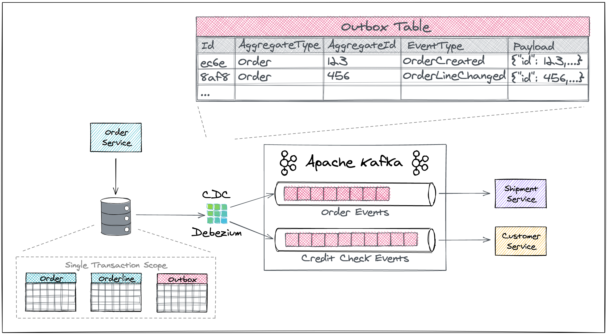

[Reliable Microservices Data Exchange With the Outbox Pattern](https://debezium.io/blog/2019/02/19/reliable-microservices-data-exchange-with-the-outbox-pattern/)

The overall solution looks like so:




## Environment

Setup the necessary environment variables

```console
$ export DEBEZIUM_VERSION=2.4.2.Final
$ export DEBEZIUM_CONNECTOR_VERSION=2.4.2.Final
```

The `DEBEZIUM_VERSION` specifies which version of Debezium images should be used.
The `DEBEZIUM_CONNECTOR_VERSION` specifies which version of Debezium connector artifacts should be used.
